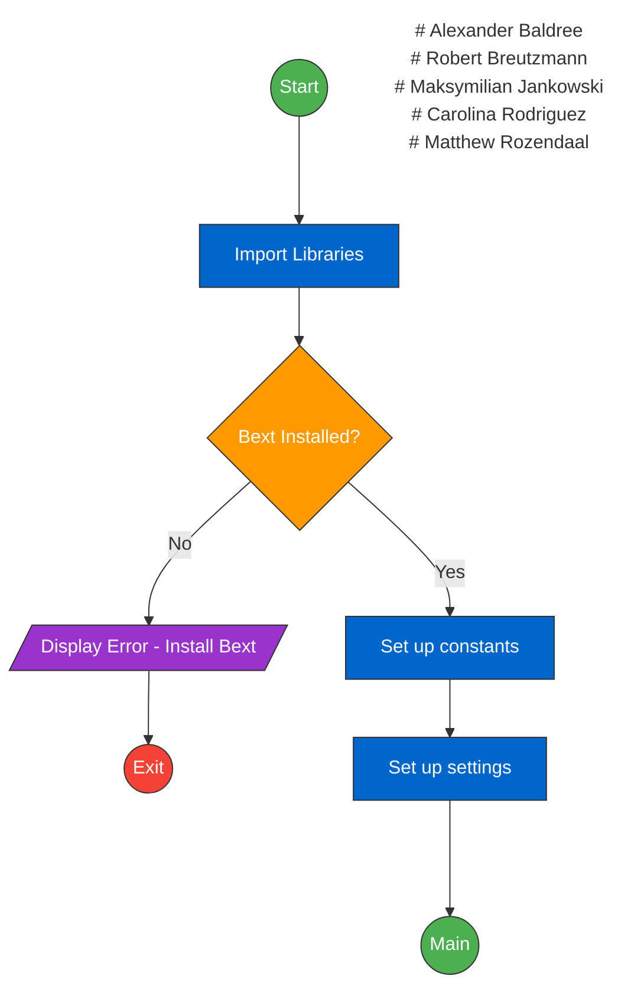
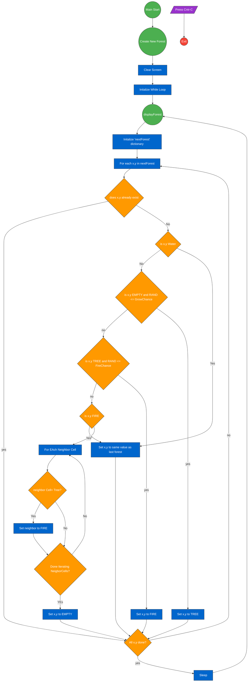
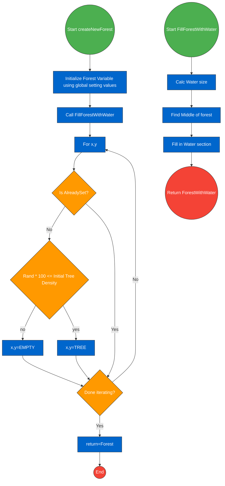
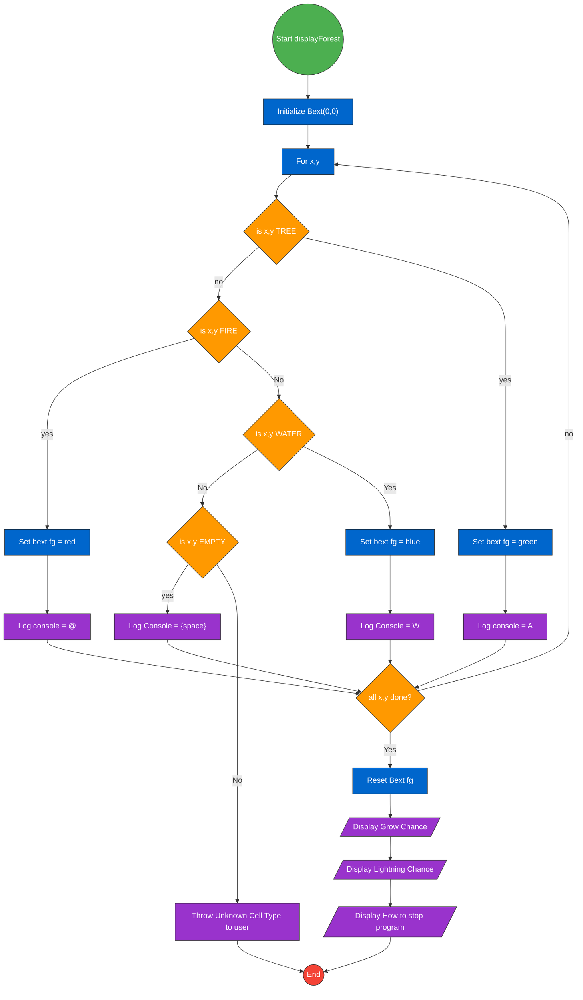

```mermaid
flowchart TB
    Start(("Start")) --> p1["Import Libraries"]
    p1 --> d1{"Bext Installed?"}
    d1 -- No --> io1[/"Display Error - Install Bext"/]
    io1 --> End(("Exit"))
    d1 -- Yes --> p2["Set up constants"]
    p2 --> p3["Set up settings"]
    p3 ---> mainF(("Main"))
    n1@{ label: "<div style=\"color:\"><div><span style=\"color:\"># Alexander Baldree</span></div><div><span style=\"color:\"># Robert Breutzmann</span></div><div><span style=\"color:\"># Maksymilian Jankowski</span></div><div><span style=\"color:\"># Carolina Rodriguez</span></div><div><span style=\"color:\"># Matthew Rozendaal</span></div></div>" }

    n1@{ shape: text}
     Start:::terminatorStart
     p1:::process
     d1:::decision
     io1:::inputOutput
     End:::terminatorFinish
     p2:::process
     p3:::process
     mainF:::terminatorStart
    classDef process fill:#0066cc,stroke:#333,color:#fff
    classDef decision fill:#ff9900,stroke:#333,color:#fff
    classDef database fill:#ffeb3b,stroke:#333,color:#000
    classDef inputOutput fill:#9933cc,stroke:#333,color:#fff
    classDef terminatorStart fill:#4CAF50,stroke:#333,color:#fff
    classDef terminatorFinish fill:#F44336,stroke:#333,color:#fff


```

```mermaid
flowchart TD
    Start(("Main Start")) --> createForest(("Create New Forest"))
    createForest --> p1["Clear Screen"]
    p1 --> p2["Initalize While Loop"]
    p2 --> displayForest(("displayForest"))
    displayForest --> p3@{ label: "Initalize 'nextForest' dictionary" }
    p3 --> p4["For each x,y in nextForest"]
    d1{"is x,y EMPTY and RAND &lt;= GrowChance"} -- no --> d2{"is x,y TREE and RAND &lt;= FireChance"}
    d2 -- no --> d3{"is x,y FIRE"}
    d3 -- no --> p5["Set x,y to same value as last forest"]
    d4{"does x,y already exist"} -- yes --> p11{"All x,y done?"}
    d1 -- yes --> p6["Set x,y to TREE"]
    d2 -- yes --> p7["Set x,y to FIRE"]
    p5 --> p11
    p6 --> p11
    p7 --> p11
    p8["Set x,y to EMPTY"] --> p11
    d8{"neighbor Cell= Tree?"} -- Yes --> p9["Set neighbor to FIRE"]
    p9 --> n2["Done Iterating NeigborCells?"]
    p11 -- no --> p4
    p11 -- yes --> p12["Sleep"]
    p12 --> displayForest
    io1[/"Press Cntr-C"/] --> End(("Exit"))
    n1["For EAch Neighbor Cell"] --> d8
    n2 -- No --> n1
    n2 -- YEs --> p8
    d3 -- Yes --> n1
    d8 -- No --> n2
    p4 --> d4
    d4 -- No --> n3["is x,y Water"]
    n3 -- No --> d1
    n3 -- Yes --> p5

    p3@{ shape: rect}
    n2@{ shape: diam}
    n1@{ shape: rect}
    n3@{ shape: diam}
     Start:::terminatorStart
     createForest:::terminatorStart
     p1:::process
     p2:::process
     displayForest:::terminatorStart
     p3:::process
     p4:::process
     d1:::decision
     d2:::decision
     d3:::decision
     p5:::process
     d4:::decision
     p11:::decision
     p6:::process
     p7:::process
     p8:::process
     d8:::decision
     p9:::process
     n2:::decision
     p12:::process
     io1:::inputOutput
     End:::terminatorFinish
     n1:::process
     n3:::decision
    classDef database fill:#ffeb3b,stroke:#333,color:#000
    classDef inputOutput fill:#9933cc,stroke:#333,color:#fff
    classDef terminatorStart fill:#4CAF50,stroke:#333,color:#fff
    classDef terminatorFinish fill:#F44336,stroke:#333,color:#fff
    classDef process fill:#0066cc, stroke:#333, color:#fff
    classDef decision fill:#ff9900, stroke:#333, color:#fff


```

```mermaid


flowchart TD
    Start(("Start createNewForest")) --> n1["Initialize Forest Variable using global setting values"]
    p1["For x,y"] --> n9["Is AlreadySet?"]
    d1{"Rand * 100 &lt;= Initial Tree Density"} -- no --> p2["x,y=EMPTY"]
    d1 -- yes --> p3["x,y=TREE"]
    p2 --> n2["Done iterating?"]
    p4["return=Forest"] --> End(("End"))
    n1 --> n6["Call FillForestWithWater"]
    p3 --> n2
    n2 -- No --> p1
    n2 -- Yes --> p4
    n3["Find Middle of forest"] --> n4["Fill in Water section"]
    n5["Calc Water size"] --> n3
    n6 --> p1
    n7(("Start FillForestWithWater")) --> n5
    n4 --> n8(("Return ForestWithWater"))
    n9 -- No --> d1
    n9 -- Yes --> n2

    n9@{ shape: diam}
    n2@{ shape: diam}
     Start:::terminatorStart
     n1:::process
     p1:::process
     n9:::decision
     d1:::decision
     p2:::process
     p3:::process
     n2:::decision
     p4:::process
     End:::terminatorFinish
     n6:::process
     n3:::process
     n4:::process
     n5:::process
     n7:::terminatorStart
     n8:::terminatorFinish
    classDef database fill:#ffeb3b,stroke:#333,color:#000
    classDef inputOutput fill:#9933cc,stroke:#333,color:#fff
    classDef terminatorStart fill:#4CAF50, stroke:#333, color:#fff
    classDef terminatorFinish fill:#F44336, stroke:#333, color:#fff
    classDef decision fill:#ff9900, stroke:#333, color:#fff
    classDef process fill:#0066cc, stroke:#333, color:#fff


```

```mermaid
flowchart TD
    Start(("Start displayForest")) --> n6["Initialize Bext(0,0)"]
    p1["For x,y"] --> d1{"is x,y TREE"}
    d1 -- no --> d2{"is x,y FIRE"}
    d1 -- yes --> p2["Set bext fg = green"]
    d2 -- yes --> p3["Set bext fg = red"]
    d3{"is x,y EMPTY"} -- yes --> p4["Log Console = {space}"]
    p4 --> d4{"all x,y done?"}
    d4 -- no --> p1
    io1[/"Display Grow Chance"/] --> n4[/"Display Lightning Chance"/]
    p2 --> n1@{ label: "<span style=\"color:\">Log console = A</span>" }
    p3 --> n2["Log console = @"]
    n1 --> d4
    n2 --> d4
    n4 --> n5["Display How to stop program"]
    n5 --> End(("End"))
    n6 --> p1
    d4 -- Yes --> n7["Reset Bext fg"]
    n7 --> io1
    d2 -- No --> n8["is x,y WATER"]
    n8 -- No --> d3
    n8 -- Yes --> n9["Set bext fg = blue"]
    n9 --> n10["Log Console = W"]
    n10 --> d4
    d3 -- No --> n11["Throw Unknown Cell Type to user"]
    n11 --> End

    n1@{ shape: rect}
    n2@{ shape: rect}
    n5@{ shape: lean-r}
    n8@{ shape: diam}
     Start:::terminatorStart
     n6:::process
     p1:::process
     d1:::decision
     d2:::decision
     p2:::process
     p3:::process
     d3:::decision
     p4:::inputOutput
     d4:::decision
     io1:::inputOutput
     n4:::inputOutput
     n1:::inputOutput
     n2:::inputOutput
     n5:::inputOutput
     End:::terminatorFinish
     n7:::process
     n8:::decision
     n9:::process
     n10:::inputOutput
     n11:::inputOutput
    classDef database fill:#ffeb3b,stroke:#333,color:#000
    classDef terminatorStart fill:#4CAF50,stroke:#333,color:#fff
    classDef decision fill:#ff9900, stroke:#333, color:#fff
    classDef terminatorFinish fill:#F44336, stroke:#333, color:#fff
    classDef process fill:#0066cc, stroke:#333, color:#fff
    classDef inputOutput fill:#9933cc, stroke:#333, color:#fff


```